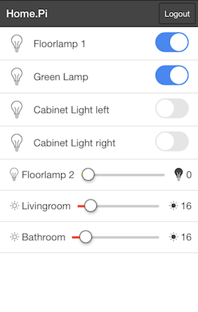

# Home.Pi

[](https://travis-ci.org/denschu/home.pi)

Simple Home Automation solution with MQTT

## Facts

* Home Automation with MQTT
* Cloud-based Micro Service Architecture (only the bindings to control the devices are running locally)
* Completely independent from the used technology (btw. most bindings are actually written in node.js)

## Screenshot



## System Architecture


## Installation

* Install and start a MQTT Broker with Websocket Support, e.g.
	* [HiveMQ](http://www.hivemq.com/)
	* [Mosquitto](http://mosquitto.org/) with [https://github.com/stylpen/WSS]
	* [Mosca](http://www.mosca.io/)

* Clone the repository and install the dependencies with NPM

```shell
	git clone https://github.com/denschu/homepi
	cd homepi
	sudo npm install -g cordova ionic gulp
	npm install
	gulp install
```

* Publish your configuration to MQTT with the topic "username/home/config" (see publish-config.sh)

Example configuration:

```json
{
	"id" : "ceiling_light",
	"type" : "on_off",
	"value" : false,
	"name" : "Ceiling Light",
	"topic" : "denschu/home/devices/livingroom/ceiling_light/value"
}
```

* Run with local HTTP Server

```shell
cd www
python -m SimpleHTTPServer 8080
mosca --http-port 8000 --http-bundle --verbose | bunyan
```
Open http://localhost:8080 in a webbrowser and provide your credentials to connect to the MQTT Broker.

* Run it as native app

```shell
sudo npm install -g cordova ionic
ionic platform add ios
ionic build ios
ionic emulate ios
```

* Run the complete stack with Docker

```shell
docker run -p 1883:1883 -p 8000:8000 -v /var/db/mosca:/db denschu/mosca-secure
docker run -d -p 80:80 denschu/homepi
```


## MQTT topic conventions

When you create the above device configuration for the GUI then you always define the topics it will subscribe to.

	<username>/home/devices/<room>/<device-name>/value
	denschu/home/devices/living_room/light1/value

The GUI application will always add a "/set" to the topicname from above when it publishes a message. The payload of the message contains the value to set on the device.

	<username>/home/devices/<room>/<device-name>/value/set <value>
	denschu/home/devices/living_room/light1/value/set true

## Available MQTT Bindings (separate git-Repositories)

Take a look at my [puppet manifests](https://github.com/denschu/homepi-puppet) to setup the Raspberry Pi very easily with puppet. You also get some help for the manual setup.

At the moment the following "experimental" MQTT bindings are available:

* [mqtt-exec](https://npmjs.org/package/mqtt-exec) Execute shell commands like "sudo shutdown -h now"
* [mqtt-zway](https://npmjs.org/package/mqtt-zway) Connect to the Z-Wave RaZBerry Server Z-Way
* [mqtt-google-calendar](https://npmjs.org/package/mqtt-google-calendar) Use Google Calendar as a scheduling engine
* [mqtt-rules](https://github.com/denschu/mqtt-rules) Create rules and execute them on incoming MQTT messages
* [mqtt-temperature](https://github.com/denschu/mqtt-temperature) Log temperature to MQTT
* [mqtt-lirc](https://github.com/denschu/mqtt-lirc) Control infrared devices

## Technologies/Frameworks

* MQTT
* Ionic Framework (with AngularJS)
* node.js

For further informations please refer to my [blog posts](http://blog.codecentric.de/en/).
