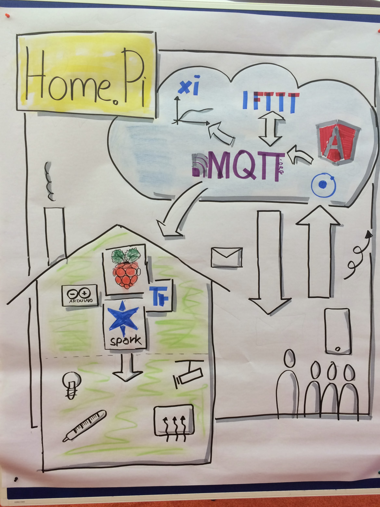

# Home.Pi 

*Simple Home Automation Solution with MQTT*

## Features

* Home Automation based on MQTT
* Customizable
* Completely independent from the used technology (most bindings are written in node.js)
* Cloud-based architecture (only the bindings for the devices are running locally)

## System Architecture

### MQTT topics 

#### Recommended naming conventions

Subscribe to a topic for getting the value of a device

	/home/devices/<room>/<device-name>/state 
	/home/devices/living_room/light1/state

Publish to a topic for setting the value of a device

	/home/devices/<room>/<device-name>/state/set <value>
	/home/devices/living_room/light1/state/set true

## Configuaration

Place you device configuration in the central configuration file "config.json".

Example:

	[
	   {
	      "id": "lamp_living_room",
	      "name": "Lamp Living Room",
	      "type": "on_off",
	      "state": "off",
	      "topic": "/home/devices/lamp_living_room/state"
	    }
	]

## Local Setup on a Mac

### MQTT Broker

	brew install mosquitto
	mosquitto

### Home.Pi

	git clone https://github.com/denschu/homepi
	npm install
	grunt serve or /etc/init.d/homepi start 

To monitor the configured topics simply subscribe to all topics

	mosquitto_sub -t /#
	
## Cloud Setup on Heroku

First install the Heroku Toolbelt (https://toolbelt.heroku.com/) and Signup for an account

Then execute the following commands from the root of the project

	grunt heroku
	cd heroku
	heroku create
	git add -A
	git commit -m 'deploy' -a
	git push heroku master
	heroku config:add NODE_ENV=production
	heroku config:add MQTT_BROKER_URL=<insert_url_mqtt_broker_here>
	heroku open
	heroku logs

See also https://devcenter.heroku.com/articles/cloudmqtt for detailed information to setup an MQTT Broker.

## Available MQTT Bindings (separate git-Repositories)

Take a look at my [puppet manifests](https://github.com/denschu/homepi-puppet) to setup the Raspberry Pi very easily with puppet. You also get some help for the manual setup.

* [mqtt-exec](https://github.com/denschu/mqtt-exec) (Execute shell commands like "sudo shutdown -h now")
* [mqtt-zway](https://github.com/denschu/mqtt-zway)
* [mqtt-temperature](https://github.com/denschu/mqtt-temperature)
* [mqtt-lirc](https://github.com/denschu/mqtt-lirc)

## Technologies/Frameworks

### Platform
* node.js
* Express (HTTP/Web Server)
* MQTT
* Ionic Framework (with AngularJS)

### Development
* Grunt
* Karma
* SublimeText2

## Planned Features

* Support different control types in the GUI: number, dimmer, switch (subtypes: light_switch, tv_switch), colour
* Edit configuration of a device in the GUI
* Integration with [Node-RED](http://nodered.org/)
* Easier deployment on local device
* More bindings
	* WakeOnLAN (wol) 
	* GPIO-PIN (RPi) 
	* IFTT 
	* REST
* Persistence with Firebase
* Websockets-to-MQTT-Bridge (any free cloud-based Services available?)
* ... make a feature request! ... or just a pull request!

For further informations and setup instructions please refer to my [blog posts](http://blog.codecentric.de/en/). 